<!-- Typing animation -->

  

<!-- Animated hero: blast radius -->

 
<i>a change in one file, and everything it touches — the kind of thing my tooling reasons about</i>

  

---

## 🙋‍♂️ About Me

**Software Engineer building AI-powered developer tools and the infrastructure behind them.** I work on RAG pipelines, knowledge graphs, and MCP servers — and on getting all of it running reliably inside other people's infrastructure.

- 🚀 Currently **Software Engineer-2 @ Bytebell**, building an AI platform for querying codebases, docs, and organizational knowledge
- 🏗️ Most of my time goes to **distribution & deployment** — shipping the same product as multi-tenant cloud SaaS and as a self-hosted enterprise package on **Kubernetes**, **Docker Compose**, and client-owned **AWS / GCP**
- 🔔 Built the **email notification system** (queued delivery + automatic retries) that keeps users updated on ingestion and deployment events without dropping a single alert
- 🧠 Deep in **TypeScript, Node.js, Fastify, MongoDB, Neo4j, Pinecone, Redis, Docker, Kubernetes, AWS, LLMs & MCP**
- 📫 Reach me at **nit8339@gmail.com**

---

## 💼 Experience

### Bytebell &nbsp;·&nbsp; *Apr 2024 – Present*

#### 🧭 Software Engineer-2 &nbsp;·&nbsp; *May 2026 – Present*

- ☁️ Deployed the platform to client-owned servers on **AWS** and **GCP**, handling infrastructure setup and production issues end to end
- 📦 Built the containerized distribution pipeline — versioned release packaging, **Docker Compose** & **Kubernetes** deployment, licensing manifests in **etcd**, **HAProxy** routing, and signed image publishing to a private registry (**AWS ECR**) — so customers run the full stack in their own environment
- 🔄 Shipped a self-updating system service that pulls signed images from the private registry, keeping single-tenant on-premise installations current with no manual upgrade work from the customer
- 🔔 Built an **email notification system** for key events (ingestion completion, deployment / system status) with **queued delivery and automatic retries**, so notifications are retried instead of lost
- ⚡ Cut end-to-end processing time by **30%** and infrastructure cost by **40%** through pipeline batching and query optimization
- 🔐 Established multi-organization access control with **RBAC**, per-org data isolation, and super-admin roles — one deployment serving multiple enterprise teams
- 🔗 Built **OAuth 2.0** integrations with **GitHub, GitLab, and Google** (GitHub Apps + GitLab REST APIs), letting organizations securely connect their accounts and repositories
- 🛠️ Resolved **150+** production issues across client deployments

#### 👨‍💻 Software Engineer-1 &nbsp;·&nbsp; *Apr 2024 – May 2026*

- 🏛️ Built and shipped a hybrid **B2B SaaS** AI developer-knowledge platform — RAG and knowledge-graph search over code repositories and documents, delivered both as multi-tenant cloud and as a self-hosted enterprise package
- 📥 Developed the content ingestion system letting companies add **Git repositories, websites, PDFs, and images**, then query them in natural language through a **Pinecone**-backed RAG pipeline
- 🔌 Built the **MCP server** exposing retrieval to coding agents, with session management, persistent connections, and per-user API keys
- 🖥️ Shipped client surfaces including a **VS Code extension** and an **Electron** desktop app for managing locally running models
- 💬 Designed the **chat system** with per-user persistent context, letting users save and reuse their own knowledge across conversations

### Coding Ninjas &nbsp;·&nbsp; *Jan 2024 – Apr 2024*

#### 🎓 Teaching Assistant &nbsp;·&nbsp; *Part-time*

- 📚 Resolved **100+** student questions on competitive programming, data structures, and algorithms
- 🤝 Mentored **50+** students, maintaining a **4.8/5** average rating

---

## 💻 Tech I Use

**Languages**

<picture>
  <source media="(prefers-color-scheme: dark)" srcset="assets/skills/skills-languages-dark.svg">
  
</picture>

**AI &amp; LLM**

<picture>
  <source media="(prefers-color-scheme: dark)" srcset="assets/skills/skills-ai-dark.svg">
  
</picture>

**Backend**

<picture>
  <source media="(prefers-color-scheme: dark)" srcset="assets/skills/skills-backend-dark.svg">
  
</picture>

**Databases**

<picture>
  <source media="(prefers-color-scheme: dark)" srcset="assets/skills/skills-databases-dark.svg">
  
</picture>

**Infra &amp; DevOps**

<picture>
  <source media="(prefers-color-scheme: dark)" srcset="assets/skills/skills-infra-dark.svg">
  
</picture>

**Frontend**

<picture>
  <source media="(prefers-color-scheme: dark)" srcset="assets/skills/skills-frontend-dark.svg">
  
</picture>

**Auth &amp; Integrations**

<picture>
  <source media="(prefers-color-scheme: dark)" srcset="assets/skills/skills-auth-dark.svg">
  
</picture>

**Tools**

<picture>
  <source media="(prefers-color-scheme: dark)" srcset="assets/skills/skills-tools-dark.svg">
  
</picture>

---

## 🧩 Where I Go Deep

Shipping software into environments you don't control is a different problem from shipping to your own cloud — no SSH when something breaks, every customer setup is different, and you still have to deliver updates, enforce licensing, and keep people informed when jobs finish or fail. Building and running that pipeline — self-hosted on Kubernetes and Docker Compose, with signed images, self-updating services, and a notification system that retries instead of dropping alerts — is the work I do best.

The other thing I obsess over is retrieval quality: closing the gap between a RAG demo that looks impressive and one that actually returns the right context on a large, messy codebase.

---

### 📫 Connect with me

